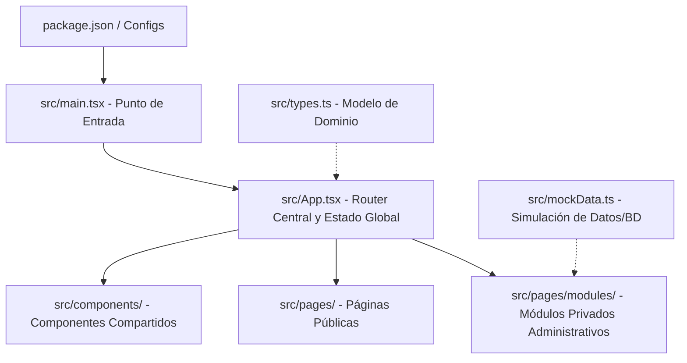

# S.M.A.R.T — Smart Mobility & Administration Resource Technology

> **Plataforma inteligente de gestión y control de transporte corporativo**
>
> Este proyecto ha sido desarrollado como prototipo funcional para la asignatura de **Técnicas de Calidad de Software**, aplicando buenas prácticas de desarrollo web, modularización y tipado seguro.

---

## 📋 Descripción General del Proyecto

S.M.A.R.T es una plataforma integral orientada a optimizar la logística, control y administración del transporte empresarial en tiempo real. Resuelve problemas críticos de planificación de rutas, asignación de conductores/buses y seguimiento del estado operativo general.

### Módulos del Sistema:
* **Dashboard:** Visualización rápida de estadísticas (buses activos, viajes en curso, alertas).
* **Gestión de Usuarios:** Registro y administración de perfiles.
* **Roles y Permisos:** Control de acceso basado en roles (RBAC) estructurado en niveles (Administrador, Operador, Conductor, Pasajero).
* **Flota de Buses:** Administración técnica, modelos, capacidades y estados de mantención.
* **Conductores:** Control de choferes, licencias activas y asignación operacional.
* **Rutas y Paraderos:** Planificación de itinerarios, paradas estándar y puntos de control.
* **Planificación de Viajes:** Asignación inteligente de buses y choferes con control de estado (Programado, En Curso, Finalizado).
* **Reportes:** Métricas operacionales y porcentaje de utilización de flota.

---

## 🏗️ Arquitectura del Software

El proyecto sigue una **Arquitectura de Monolito Modular en el Frontend**, implementada mediante **Component-Based Architecture (Arquitectura Basada en Componentes)** en el ecosistema de React.



### 1. Componentización y Responsabilidad Única
* **UI Components (`src/components/`):** Elementos visuales puros y reutilizables ([Header.tsx](file:///c:/Users/fred2/Downloads/S.M.A.R.T%20—%20Smart%20Mobility%20&%20Administration%20Resource%20Technology/src/components/Header.tsx), [Sidebar.tsx](file:///c:/Users/fred2/Downloads/S.M.A.R.T%20—%20Smart%20Mobility%20&%20Administration%20Resource%20Technology/src/components/Sidebar.tsx), [Common.tsx](file:///c:/Users/fred2/Downloads/S.M.A.R.T%20—%20Smart%20Mobility%20&%20Administration%20Resource%20Technology/src/components/Common.tsx)).
* **Page / Module Components (`src/pages/`):** Componentes de alto nivel que estructuran cada sección operativa del negocio de forma aislada.

### 2. Ruteo Basado en Estado (State-Driven Routing)
En lugar de cargar pesadas librerías externas en esta etapa, el enrutamiento está centralizado en [App.tsx](file:///c:/Users/fred2/Downloads/S.M.A.R.T%20—%20Smart%20Mobility%20&%20Administration%20Resource%20Technology/src/App.tsx) mediante un manejador del hash de la URL (`window.location.hash`), lo que asegura una navegación instantánea (Single Page Application - SPA) y limpia.

### 3. Capa de Modelado de Datos y Tipado Seguro (Type-Safe Data)
* **TypeScript (`src/types.ts`):** Define el modelo de dominio del negocio. Restringe el flujo de datos para evitar valores nulos u objetos con campos mal escritos.
* **Mock Data (`src/mockData.ts`):** Representa el estado inicial de la base de datos, facilitando pruebas de visualización del negocio en tiempo de ejecución.

### 4. Sistema de Diseño Desacoplado
Los estilos están modularizados para facilitar cambios visuales masivos sin tocar código React:
* `variables.css`: Paleta de colores tecnológica (Cyber Teal & Slate Blue), tipografías y variables globales de glassmorphism.
* `style.css`: Estilos de landing page, secciones informativas y login.
* `dashboard.css`: Estructura del panel administrativo, tablas y barras de navegación.

---

## 📈 Próximas Mejoras y Hoja de Ruta

Para cumplir con los estándares de la asignatura de **Técnicas de Calidad de Software**, se proyectan las siguientes implementaciones:

### 1. Pruebas Automatizadas (Testing)
* **Pruebas Unitarias:** Configurar **Vitest** y **React Testing Library** para probar componentes de UI de manera aislada.
* **Pruebas de Integración:** Verificar los flujos de simulación de roles y restricciones de acceso (RBAC).

### 2. Backend e Integración de API (Persistencia de Datos)
* Desarrollar una API REST (Node.js/Express o C#/.NET) para transformar la aplicación en un monolito fullstack clásico.
* Reemplazar la capa de `mockData.ts` con consultas asíncronas `fetch` / `axios` conectadas a una base de datos relacional (PostgreSQL / SQL Server).

### 3. Seguridad y Sesiones Reales
* Reemplazar el login simulado por autenticación basada en tokens JWT (JSON Web Tokens).
* Encriptación de contraseñas y validaciones robustas en formularios frontend y backend.

### 4. Métricas de Calidad y CI/CD
* Incorporar análisis estático avanzado de código (ESLint, Prettier, SonarQube).
* Configurar pipelines de integración continua (GitHub Actions) para compilar y testear de forma automática en cada Push a la rama `main`.

---

## 🚀 Cómo Ejecutar el Proyecto Localmente

```bash
# 1. Clonar el repositorio (si no se ha hecho)
git clone https://github.com/freddy192023/S.M.A.R.T.git

# 2. Instalar las dependencias
npm install

# 3. Iniciar el servidor de desarrollo
npm run dev

# 4. Compilar para producción (Production Build)
npm run build
```
